# End-to-End Training of a Classification Model with Synthetic Data
Training a classification model to identify new ship types in marine oblique scenes.

## Objectives 
To demonstrate how the Rendered.ai Platform as a Service can be used to generate customized synthetic imagery data to train and test computer vision systems with:  
- Improved model performance 
- Significantly reduced development time 
- A more diverse set of training scenarios 
- Smaller amounts of real data 

## Test Dataset 
The open source [Roboflow Ships](https://www.kaggle.com/datasets/vinayakshanawad/ships-dataset) image classification dataset from [Kaggle](https://www.kaggle.com). This real dataset is broken down into 10 classes:

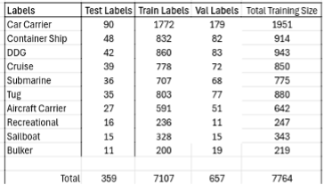

## Model 
NVIDIA TAO v5.5 with backbone pre-trained weights from the tiny Fully Attentional Network (FAN) model. Available in NVIDIA’s [NGC Catalog](https://catalog.ngc.nvidia.com/orgs/nvidia/teams/tao/models/pretrained_fan_classification_imagenet).

## Methodology Used
### 1. Establishing a Baseline of Target Model Performance
The amount of data used to train a model is as important as the hyperparameters used to tune performance. Learning rates and number of epochs are correlated to how many training samples are used. Intentionally restricting the amount of real data helps to establish a baseline to determine how much data is needed to train a computer vision model. It is effective to think of the baseline as a curve that represents the accuracy of classification models trained on various amounts of real data.  

#### Focusing On a Limited Number of Classes 

To accelerate the development time for this example, engineers focused on four classes: aircraft carriers, sailboats, submarines, and tugboats. They first tuned the hyperparameters to train a model on the real “Roboflow Ships Image” data to perform like the reported accuracy on the Kaggle classification dataset. Engineers found that using the default learning rate and epoch number for the TAO PyTorch Classification Model Trainer provided poor accuracy. By experimenting with and analyzing the loss curves, they realized that the learning rate was too high. Lowering the starting learning rate to 1e-4 and cutting the epochs down to 50-100 resulted in a model with acceptable accuracy. Training the FAN Tiny backbone on 99% of the real dataset resulted in better accuracy in all classifications, except for the sailboat class. 

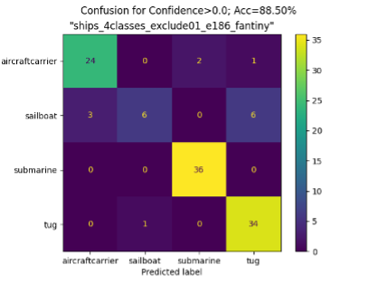

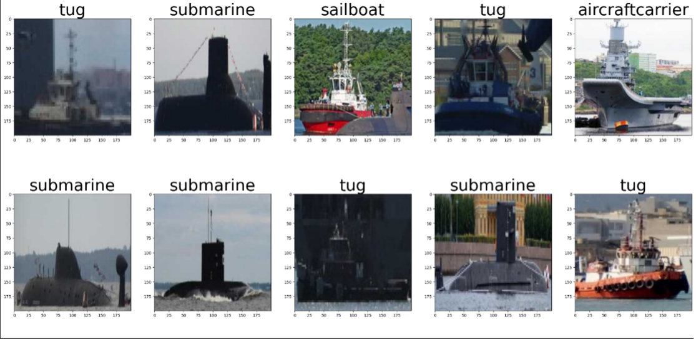

Another challenge was found in the loss estimated at each epoch during training. Engineers used a learning rate of 1E-4 and trained for 186 epochs. This resulted in a converged model at risk of overfitting. This exercise helped the engineers understand that using 125 epochs for this learning rate and amount of training data was sufficient.

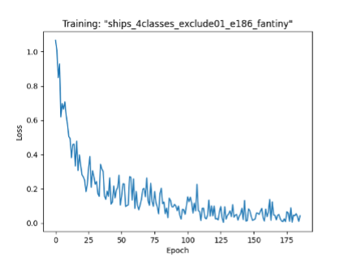

#### Balancing the Number of Epochs 
To evaluate the amount of real data needed to achieve target model performance, engineers removed fractions of data from each class. This can cause overfitting if the real dataset is large. To model a ballpark number of epochs for a given dataset size, the engineers estimated an appropriate number of epochs for a few datasets of disparaging sizes. Specifically, they fixed the learning rate to 1x10^-4 and then found the best model accuracy for various number of epochs. The three values were then fit by linear regression for the model as shown in the chart below. 

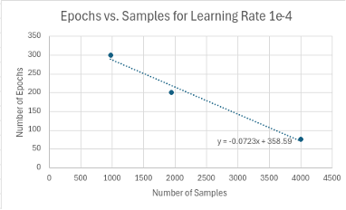

#### Determining Baseline Measurement
Using this model for a balanced number of epochs and fixed learning rate, engineers trained on fractions of the real data. The accuracy remained in the upper 80th percentile for all fractions above 40%. This indicated that too much training data was already being used. 

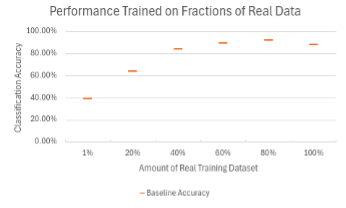

This determined a baseline measurement by which they could determine how much synthetic data would be effective.

### 2. Generating Synthetic Data
In machine learning, “zero-shot” training refers to the absence of samples for a class, a common challenge for computer vision engineers. Various approaches can be taken to compensate for missing data, like tweaking weights and merging hypothesis classes into a generalized class. To maintain the integrity of the model to meet performance objectives, synthetic data samples were used instead. 

#### Scenario Variation
To match the scenario of the real dataset from Kaggle, ship placement, scene background (including sun placement), atmospheric conditions, camera location, and rotation were randomized using configurable workflows in the Rendered.ai platform, called “graphs”. 

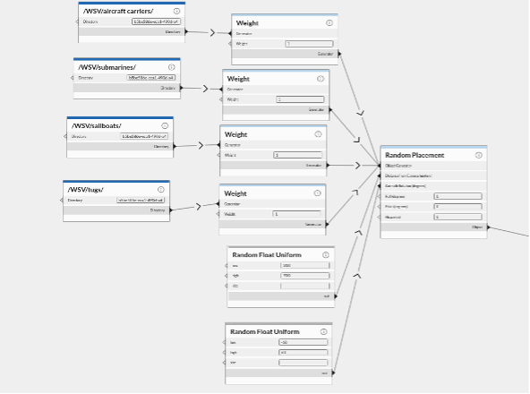

A variety of 3D assets representing samples for different classes shown in the following chart were loaded into the Rendered.ai platform and graph. 

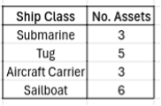

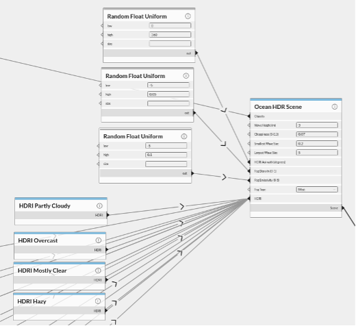

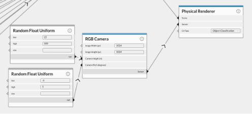

Adjusting the distance from the camera within this graph enabled control of object resolution, from which the following images of aircraft carriers and tugboats were generated that looked similar to the real image samples from the Kaggle dataset. 

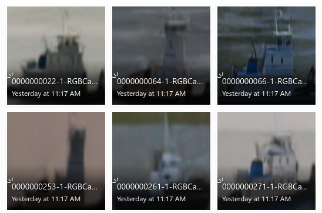

### 3. Training and Evaluating the Zero-Shot Model 

### Initial Experiment
An experiment was designed to reproduce the curve seen in the baseline measurement using synthetic data instead of real data. The synthetic data training set used had 1,000 images for each class.

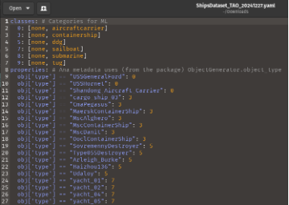

By applying the learnings from determining a performance baseline with the TAO Classification model and using only the first set of synthesized data, engineers initially achieved a zero-shot performance of 51.3% with model bias caused by the aircraft carrier data. 

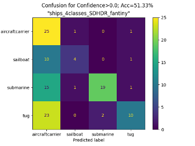

This told the engineers that the synthetic dataset needed to be modified to increase the representation of other object classes to improve overall model performance. 

### 4. Analyzing Performance & Updating the Model 

By comparing the failed classifications from the initial experiment to the synthetic training data, the engineers observed a few areas of opportunity to make quick parameter changes in the Rendered.ai graph and rapidly generate a new synthetic dataset. The graph was used to easily adjust attributes like camera focus, boat heave and movement, reduce blur, and add more 3D models of submarines with varying surface elements (e.g., rust, warp, snow) to create a more physically accurate and diverse set of synthetic imagery.

Additional expertise was required to increase the quality of the lowest performing classes of synthetic data: sailboats and tugboats. Rendered.ai’s team of engineers added higher-resolution samples of sailboats and tugboats to the Kaggle training datase, as well as additional sailboat models with varying masts and randomized heeling angles to improve the model’s classification accuracy. 

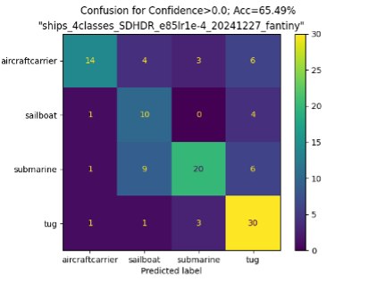

The updates engineers made to the Rendered.ai graph generated a new synthetic dataset that, when used alone, resulted in a satisfactory 65.49% zero-shot accuracy and improved all the classes of concern in a short period of time. 

### 5. Testing Combinations of Synthetic and Real Data on Model Performance 

#### Model Finetuning
With the backbone having a good chance of detecting all classes of interest, fewer real samples should have now been needed to optimize model performance. Rendered.ai’s engineers however found that training the zero-shot model as a pretrained backbone with the same learning rate and epoch counts on synthetic data and then the real Kaggle Ships Image Dataset did not improve model performance. Fine-tuning the model with the hyper-parameters used for the real data (a fixed learning rate with balanced number of epochs) resulted in little to no improvement of the classification accuracy over the baseline.

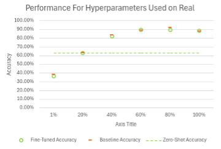

Rendered.ai’s engineers hypothesized this occurred because it had wiped out the pretrained weights. The hyper-parameters could be adjusted for a lower learning rate to correct this, but it would require more epochs to achieve convergence and would extend training time significantly. 

#### The Solution

Instead of training the FAN Tiny backbone on synthetic data and real data in separate cycles, engineers tested merging the datasets together to train the FAN Tiny backbone directly. Larger training datasets (between 4,500 and 7,000 samples) with fewer epochs (50 and 100 epochs) were used, resulting in a clear indication that far less real data was required to optimize model performance. 

### The Results
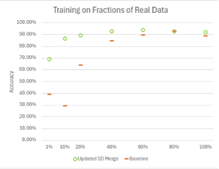

Engineers found that only 10% of Kaggle’s real dataset was required when combined with synthetic data to achieve the same, if not better, performance as the real dataset. Model performance topped out at 94% accuracy using a merged dataset of only 60% of the real dataset from Kaggle and 40% of customized synthetic data generated in the Rendered.ai platform, compared to the model performance of 87% accuracy reported by Kaggle* with the real data alone. 

Kaggle Challenge, https://www.kaggle.com/code/nnghiapd/cnn-with-87-accuracy

### Impact
With an open-sourced real test dataset, a standard computer vision model for this use case, and the Rendered.ai platform and team expertise, engineers demonstrated that they can effectively train a classification model to perform: 
- Much faster 
- With a lower reliance on real data
- At a higher accuracy rate for a broader set of classes

The additional expertise of the Rendered.ai team and the ability to quickly iterate on synthetic data generation workflows in the Rendered.ai platform made it possible to train, experiment with, and arrive at a performant classification model in a matter of days.

***Are you ready to experiment with synthetic data generation from this test case?*** [Start your free trial](https://rendered.ai/free-trial/) of the Rendered.ai Platform and use content code: ________ to explore the Marine Oblique Workspace preloaded with all of the assets used.

***Need help validating the effectiveness of synthetic data for a different use case?*** [Request a personalized consultation](https://rendered.ai/talk-to-sales/) with the experts at Rendered.ai. 
